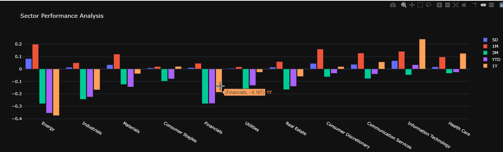
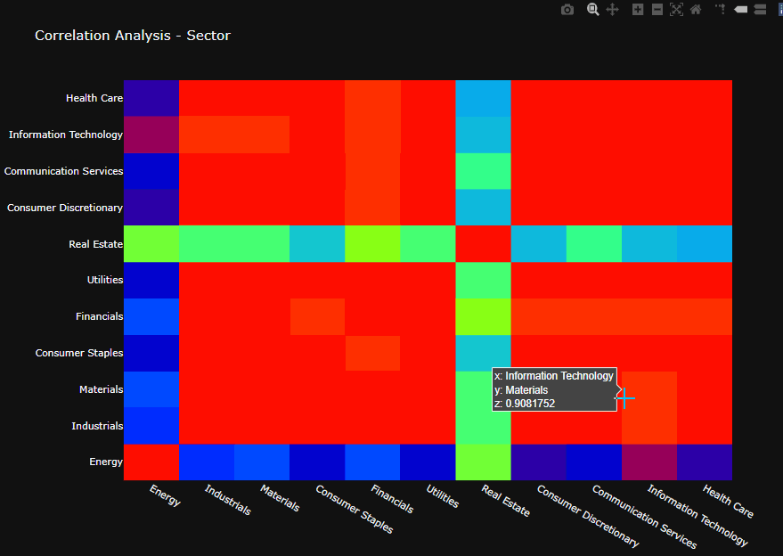
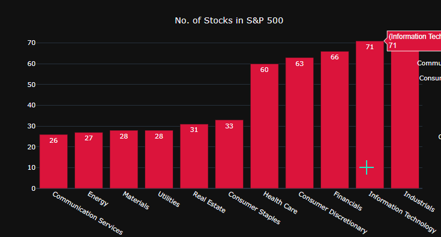
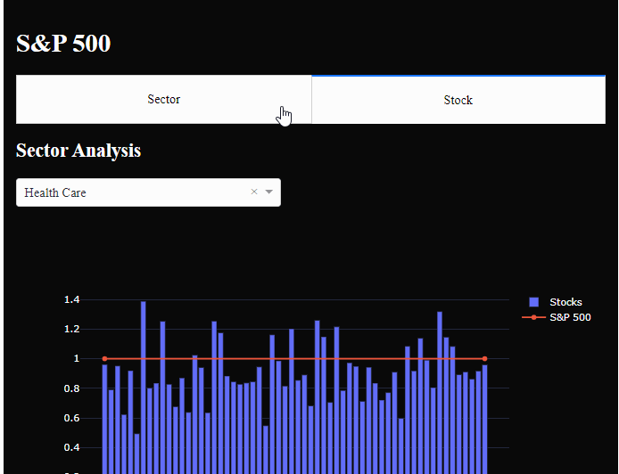

# Project SP500 Sector Summary
This project illustrates the SP500 real-time performance by sector and by the stocks that make up each sector. Most importantly, our team dedicated themselves to making this project user friendly, so that any interested investor can operate and perform correlation analysis along with simple time series analysis. See below to get an overview of our interactive dashboard.  

## The Dashboard

